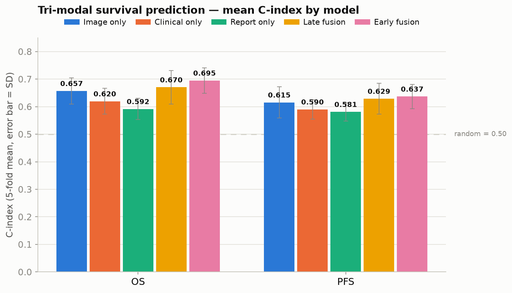
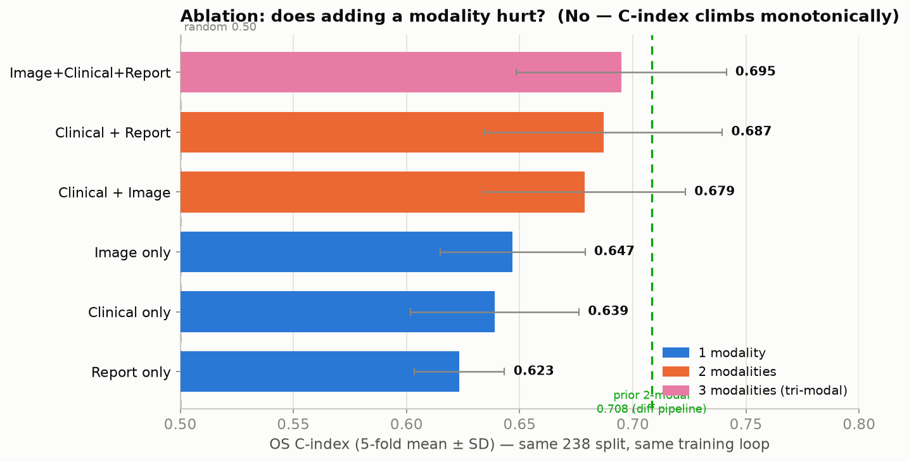
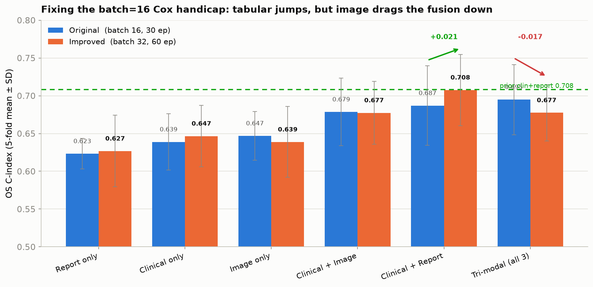
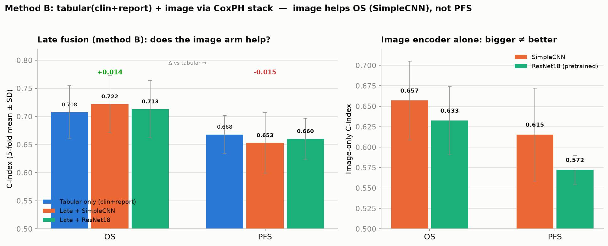
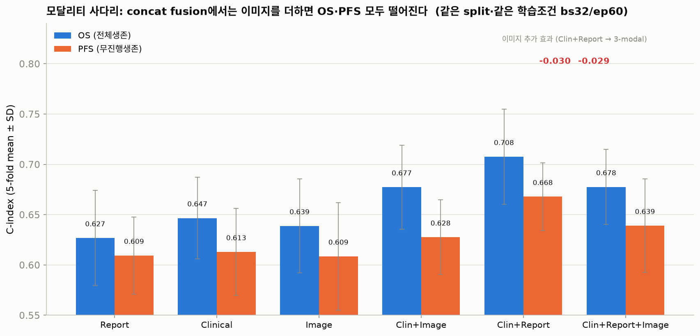
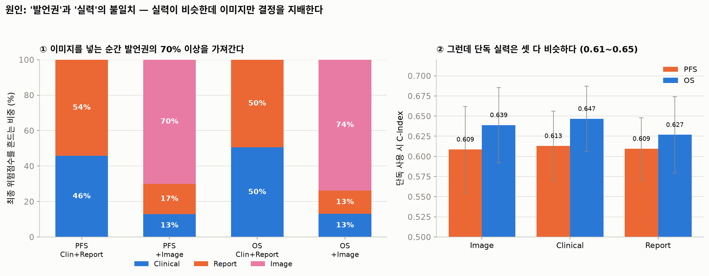
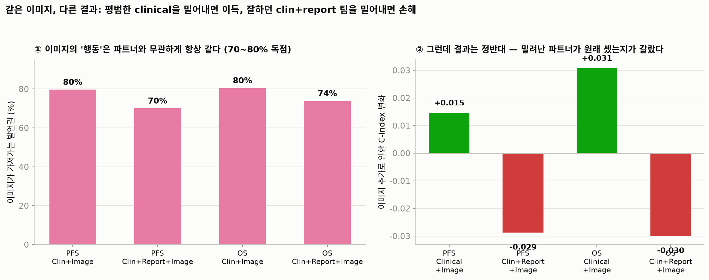
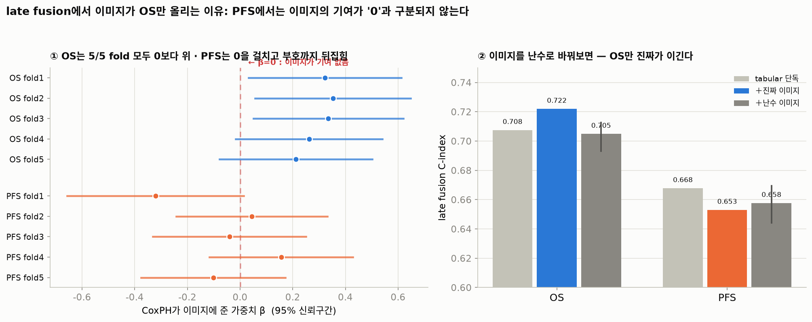
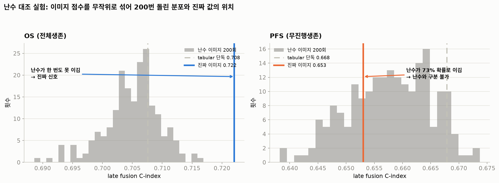
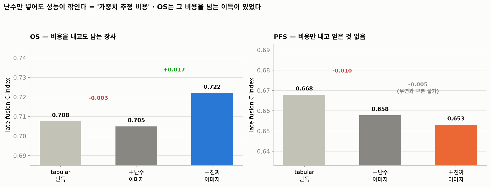

# SCLC Tri-modal Fusion — 학습 결과 & 진단 리포트

> Image(SimpleCNN) + Clinical + Report 생존예측. 5-fold CV (seed 42, 238명 공통 코호트),
> 지표 Harrell's C-index (0.5 = 무작위). 학습환경 RTX 4070 Ti SUPER, torch 2.12.1+cu126.

---

## TL;DR (핵심 결론)

1. **초기 tri-modal early fusion = OS 0.695 / PFS 0.637.** 그런데 이전 clinical+report(2-modal) 실험은 OS 0.708이었음 → "이미지를 더했는데 왜 떨어지나?"를 조사.
2. **원인은 이미지가 아니라 학습 조건이었음.** `batch_size=16` 미니배치 Cox loss가 Cox risk set을 16명으로 제한해 **tabular 브랜치를 과소학습**시켰음. batch를 키우고 스텝 수를 맞추자 clinical+report가 **0.687 → 0.708 → 0.713**으로 회복(원본 재현).
3. **concat(early) fusion에서는** tabular를 제대로 학습시키면 SimpleCNN 이미지가 오히려 깎음: clinical+report=**0.708** vs tri-modal(all)=**0.678**. 이미지 CNN이 scratch·과적합 + concat이 모달별 스케줄 충돌을 강제.
4. **그러나 late fusion으로 바꾸면 이미지가 OS에 도움이 됨(직관 확정, 섹션 8):** clin+report(0.708)에 SimpleCNN을 CoxPH로 결합 → **OS 0.722** (+0.014). concat에서 −0.017이던 이미지가 late에서 +0.014로 부호 반전 → **SimpleCNN의 문제는 이미지가 아니라 concat 구조였음.** 단 **PFS는 이미지 도움 없음**(late도 0.653/0.660 < 0.668) → **이유는 섹션 10에서 정식 검정** (아래 10번 항목).
5. **"더 강한 백본=ResNet"은 역효과** — 사전학습 ResNet18 단독 0.633 < SimpleCNN 0.657 (ImageNet→grayscale PET-CT 도메인 불일치).
6. **권장 최종 모델:** OS = **late fusion clin+report + SimpleCNN (0.722)**, PFS = **clin+report 단독 (0.668)**.
7. **concat이 깎는 진짜 이유 = "발언권 배분 실패" (섹션 9, ablation 6조합 × OS/PFS 전수).** ※ 섹션 9의 수치는 **concat fusion 한정** — 같은 3모달이라도 **concat 0.678 vs late 0.722(섹션 8)** 로, 재료가 아니라 **섞는 방법**이 성능을 가름. 이미지를 넣으면 최종 위험점수의 **70.0%(PFS) / 73.8%(OS)** 를 이미지가 차지하고 판독지는 **54%→17%** 로 밀려남. **이미지는 clinical 단독에 붙여도 80%를 가져가므로 이건 report의 존재와 무관한, 이미지 브랜치 자체의 일관된 편향**(9.4.1) — 다만 clinical만 밀어낼 땐 이득(clinical이 원래 평범해서), clin+report 팀을 밀어낼 땐 손해(그 팀이 원래 최고 성능이라서). 그런데 세 모달리티의 **단독 실력은 0.61~0.65로 비슷** → 가장 약한 재료가 결정을 지배. 원인은 브랜치마다 `F.normalize`로 크기를 1로 강제해 **모델이 못 믿는 모달리티를 줄일 수단이 없는 구조** + 차원 불균형(image 128 / clinical 128 / **report 16**, 파라미터 10배).
8. **이건 PFS만의 문제가 아니었음.** concat에 이미지 추가 시 손해가 **OS −0.030 / PFS −0.029로 거의 동일**. 또 **이미지는 나쁜 재료가 아님** — clinical에만 더하면 OS **+0.031** / PFS **+0.015**로 도움. 판독지가 있을 때만 해로워짐. OS와 PFS의 진짜 차이는 fusion을 고쳤을 때 드러남(late fusion 이미지 계수 OS **+0.30** vs PFS **−0.05**).
9. **기각된 가설도 기록:** "이미지가 더 과적합한다"는 **틀림**(학습 최고점 0.764로 동일). "이미지=판독지 중복"은 **약하게만** 지지(Spearman +0.244). ⚠️ C-index 하락 자체는 **5-fold로는 유의하지 않음**(paired t p=0.19~0.32, 방향만 일관) — 근거의 무게는 **기여도 70%** 쪽에 있음.
10. **★[교수님 질문에 대한 답] late fusion에서 OS만 오르고 PFS는 떨어지는 이유 = "이미지에 PFS 고유 정보가 없기 때문" (섹션 10).** CoxPH가 이미지에 준 가중치 β를 직접 검정했더니 **OS는 β=+0.322 (p=0.008, 5/5 fold 양수)로 확실한 신호**인 반면 **PFS는 β=+0.008 (p=0.948, 부호가 fold마다 뒤집힘)로 0과 구분 불가**. 우도비 검정도 OS χ²=6.69(p=0.010) vs **PFS χ²=0.00(p=0.948)** — 이미지가 더한 정보량이 문자 그대로 0. 결정적으로 **이미지 점수를 난수로 바꿔 200번 돌려보니, OS는 난수가 단 한 번도 못 이겼고(0/200) PFS는 난수가 73%(146/200) 이겼다.** 왜 "제자리"가 아니라 "하락"인가? 결합 모델은 쓸모없는 변수라도 **가중치를 추정해야 하는 비용**을 치르기 때문 — **정보가 0인 난수를 넣어도 0.668 → 0.658로 깎인다**(진짜 이미지 0.653은 난수 분포 95% 구간 [0.644, 0.670] **안**에 위치 = 난수와 구분 불가). 근거 문헌: **Harrell, Lee & Mark, *Stat Med* 1996 (피인용 9,856)** — Cox 예후모델의 과적합·shrinkage 고전. ⚠️ **초안의 "PFS가 더 중복이라서"는 오류**(fold를 섞어 계산한 artifact); fold 내부 상관은 OS 0.459 / PFS 0.468로 **거의 같음**(중간 정도 상관).
11. **섹션 9와 섹션 10은 서로 다른 문제 — 섞지 말 것.** 섹션 9(**concat**)는 "섞는 방법의 문제"(이미지가 발언권 독점 → OS·PFS 둘 다 −0.030)이고 fusion을 바꾸면 해결됨(실제로 late fusion에서 OS 0.722로 회복). 섹션 10(**late**)의 PFS 문제는 "**재료의 문제**"(이미지에 PFS 정보가 없음)이라 **fusion을 아무리 개선해도 해결 불가.** → PFS에서 영상을 살리려면 fusion 기법이 아니라 **영상에서 다른 정보를 뽑아야 함**(치료 전후 변화량, radiomics 등).
12. **[후속 실험 완료] 구조 수정(9.7의 3·4번)은 실패 — 그러나 진단이 정교해짐 (→ [RESULTS_fusion_fix.md](RESULTS_fusion_fix.md)).** 정규화 제거·학습가능 스케일·report 차원확대 등 10개 변형을 OS/PFS 전수 실험했으나 **clin+report(0.708/0.668)를 넘은 변형 없음**(최고 tri-modal 0.698/0.651). 핵심 수확은 **9.4의 진단 정정**: "구조가 이미지를 못 줄이게 막는다"는 **틀렸고**(학습가능 스케일이 6개 실험 전부 1.0에서 불변 = head 가중치와 수학적 중복), 실제로는 **모델이 줄일 수 있는데도 스스로 이미지에 큰 가중치를 주는** 것 = **최적화 과정의 문제**(modality competition / greedy learning). → 다음은 구조 미세조정이 아니라 **입력의존 게이트(GMU)** 또는 **학습전략 개입(Gradient Blending·OGM-GE)**.

---

## 1. 실험 개요

| 항목 | 내용 |
|---|---|
| 코호트 | 238명 (image·clinical·report 모두 보유), `trimodal_common_5fold_seed42_v1.csv` |
| 타깃 | OS(전체생존), PFS(무진행생존) — Cox 부분우도 손실 |
| 검증 | 5-fold CV, seed 42, fold별 best-val-cindex 체크포인트 선택 |
| 두 fusion | **early**(concat→선형 Cox head, end-to-end) / **late**(단일모달 3개 학습 후 CoxPH 가중합) |

---

## 1.5 모델 구조 요약 (인코더 · 레이어 · dropout)

실험마다 백본/융합이 바뀌므로 참조용으로 정리. 모든 브랜치 출력은 early fusion에서 **L2 정규화** 후 concat.

### (a) 모달리티 인코더

| 모달 | 인코더 형식 | 레이어 구성 | 출력차원 | Dropout | 입력 |
|---|---|---|---|---|---|
| Image · SimpleCNN | 4× ConvBlock + FC (scratch) | ConvBlock=[Conv3×3(bias없음)–BN2d–ReLU–MaxPool2] ×4, ch 1→32→64→128→256 → AdaptiveAvgPool → Linear(256,512) | 512 | — | grayscale 512² |
| ↳ early fusion 투영 | 투영 head | Linear(512,128)–ReLU–Dropout | 128 | **0.2** | |
| ↳ image-only head | Cox head | Dropout–Linear(512,1) | 1 | 0.2 | |
| Image · ResNet18 | ImageNet **pretrained** ResNet18 | conv1을 1채널로 교체(사전학습 RGB 필터 평균), fc→Identity, head=Dropout–Linear(512,1) | 512 | **0.3**(head) | grayscale 224², flip 증강 |
| Clinical | MLP | [Linear–BN1d–ReLU–Dropout] **×4 @128** | 128 | **0.5** | 21개(연속 8 표준화 + 범주 13) |
| Report | char n-gram TF-IDF → MLP | TF-IDF(char_wb, n-gram 2–4, max_features=400) → [Linear–BN1d–ReLU–Dropout] **×2 (32,16)** | 16 | **0.3** | 마스킹된 report 텍스트 |

### (b) 융합(fusion) head

| 융합 방식 | 구조 | 학습 |
|---|---|---|
| Early · tri-modal concat | L2(img 128) ⊕ L2(clin 128) ⊕ L2(rep 16) = **272** → Dropout(0.3) → Linear(272→1, bias없음) → Cox | end-to-end |
| Early · clin+report concat | L2(clin 128) ⊕ L2(rep 16) = **144** → Dropout(0.3) → Linear(144→1) → Cox | end-to-end |
| Late · weighted-sum | 각 모달 단일 DeepSurv의 OOF 위험점수 → lifelines **CoxPHFitter**(2~3 covariate 계수 = 가중치) | 2-stage |

손실: **Cox 음의 부분우도**(이미지 포함 모델은 커스텀 torch 루프; late fusion의 tabular 단일모달 arm은 pycox CoxPH). 모든 fold는 **best-val-cindex 체크포인트**(조기종료) 선택, seed 42+fold, 5-fold.

### (c) 학습 하이퍼파라미터 (실험별)

| 실험 | batch | epochs | learning rate | optimizer (wd) |
|---|---:|---:|---|---|
| Early fusion 초기 | 16 | 30 | 1e-4 | Adam (1e-4) |
| 개선 조건(tabular 회복) | 32 | 60 | 1e-4 | Adam (1e-4) |
| Tabular sweep 최고 | 64 | 120 | 1e-4 | Adam (1e-4) |
| Image SimpleCNN (late arm) | 16 | 30 | 1e-4 | Adam (1e-4) |
| Image ResNet18 (late arm) | 16 | 30 | backbone **1e-5** + head **1e-3** | Adam (1e-4) |
| Tabular 단일모달 (late A, pycox) | 16 | 30 | 1e-4 | Adam |

---

## 2. 초기 결과 (batch 16, 30 epochs)



| 모델 | OS | PFS |
|---|---|---|
| Image only | 0.657 | 0.615 |
| Clinical only | 0.620 | 0.590 |
| Report only | 0.592 | 0.581 |
| Late fusion (weighted-sum) | 0.670 | 0.629 |
| **Early fusion (tri-modal)** | **0.695** | **0.637** |

초기 조건에서는 tri-modal이 최고였고 모든 fold가 0.5를 상회(중단 없이 완료). 하지만 **이전 clinical+report 단독 실험(OS 0.708)보다 낮아** 원인 조사를 진행.

---

## 3. 진단 ①: 이미지가 성능을 깎는가? → 아니오 (초기 조건 기준)

같은 238 split·같은 학습 루프에서 모델의 **브랜치 구성만** 바꾼 ablation (OS, batch 16):



| 구성 | 모달 수 | OS C-index |
|---|---|---|
| Report only | 1 | 0.623 |
| Clinical only | 1 | 0.639 |
| Image only | 1 | 0.647 |
| Clinical + Image | 2 | 0.679 |
| Clinical + Report | 2 | 0.687 |
| **Tri-modal (all)** | 3 | **0.695** |

→ 초기 조건에선 모달을 더할수록 단조 증가. **이미지는 오히려 단일 최강 모달(0.647)**이고, 추가하면 성능이 올랐음. 즉 "이미지 때문에 떨어졌다"는 잘못된 진단. 진짜 문제는 이 파이프라인의 clinical+report **재현치 자체가 0.687**로 원본 0.708보다 낮다는 점(차이 0.021 < 1 SD).

---

## 4. 진단 ②: 왜 clinical+report가 0.687밖에 안 되나? → batch=16 Cox 핸디캡

Cox 부분우도가 **미니배치 16명 안에서만** risk set을 구성 → tabular 학습이 불리
([train.py:47](train.py#L47), [train.py:239](train.py#L239)). 512² 이미지 메모리 때문에
batch=16이 강제되지만, 원본 tabular 모델은 훨씬 큰 risk set으로 학습됨.

**batch sweep (clin+report, 30 epoch 고정):** 16→0.687, 32→**0.693**, 64→0.667, 128→0.650, 256→0.560.
배치를 키우면 스텝 수가 줄어(fold train ≈190) 과소적합이 겹침.

**스텝 수를 맞춘 regime test (clin+report):**

| batch | epochs | ≈steps | OS C-index |
|---:|---:|---:|---:|
| 16 | 30 | 360 | 0.687 |
| 32 | 60 | 360 | **0.708** |
| 64 | 120 | 360 | **0.713** |

→ 스텝을 맞추자 **risk set이 클수록 단조 상승**, 원본 0.708을 정확히 재현(초과). **batch=16이 진짜 원인**임을 확정.

---

## 5. 개선 조건 재학습 (batch 32, 60 epochs) — 그리고 반전



| 구성 | 원본 (bs16/ep30) | 개선 (bs32/ep60) | 변화 |
|---|---|---|---|
| Report only | 0.623 | 0.627 | ~ |
| Clinical only | 0.639 | 0.647 | ~ |
| Image only | 0.647 | 0.639 | ↓ (이미지 과적합) |
| Clinical + Image | 0.679 | 0.677 | ~ |
| **Clinical + Report** | 0.687 | **0.708** | **+0.021 ↑** |
| **Tri-modal (all)** | 0.695 | **0.678** | **−0.017 ↓** |

**반전 포인트:** 개선 조건은 tabular(clinical+report)를 0.708로 끌어올렸지만, **tri-modal은 오히려 떨어졌음(0.695→0.678).** image_only도 epoch를 늘리자 하락(0.647→0.639). 즉 scratch로 학습되는 **이미지 CNN은 더 오래 학습하면 과적합**하고, 그 과적합 신호가 fusion을 끌어내림.

**결론:** 이전의 "tri-modal 0.695"는 사실상 **덜 학습된 clinical+report**였을 뿐. tabular를 제대로 학습시키면 **SimpleCNN 이미지는 clinical+report에 보탬이 안 되고 오히려 깎음.** 모달마다 최적 학습 스케줄이 달라(tabular는 큰 배치+많은 스텝을 원하고, 이미지 CNN은 짧은 학습을 원함) 하나의 공동 end-to-end 스케줄로는 둘을 동시에 만족시키기 어려움.

### PFS 확인 (같은 경향)

| 구성 | 개선 bs32/ep60 |
|---|---|
| Tri-modal (all) | 0.639 |
| Clinical + Image | 0.628 |
| **Clinical + Report** | **0.668** |

PFS도 동일 — clinical+report(0.668)가 tri-modal(0.639)을 앞서고, 이전 PFS 0.654도 상회.

---

## 6. 최종 권장

| 순위 | 모델 | OS | PFS | 비고 |
|---|---|---|---|---|
| **1** | **Clinical + Report (bs64/ep120)** | **0.713** | — | 최고 OS |
| 1 | Clinical + Report (bs32/ep60) | 0.708 | **0.668** | 원본 0.708 재현, 안전/저비용 |
| 3 | Tri-modal all (bs16/ep30) | 0.695 | 0.637 | 과소학습 tabular의 착시 |
| 4 | Tri-modal all (bs32/ep60) | 0.678 | 0.639 | 이미지 과적합이 fusion을 깎음 |

- **채택 모델: 잘 학습된 clinical + report.** 원본 성능을 재현하며 가장 간단·안정적.
- **SimpleCNN 이미지는 현재 형태로는 기여하지 않음.** 이미지를 살리려면 다음이 필요:
  1. **더 강한 이미지 백본**(ImageNet/의료영상 pretrained) 또는 강한 정규화·데이터증강으로 과적합 억제,
  2. **모달별로 독립 튜닝하는 late fusion**(이미지는 짧게, tabular는 크게 학습 후 CoxPH 결합),
  3. 또는 early fusion에서 **이미지 브랜치에 별도 LR/epoch·조기종료**를 부여(공동 스케줄 분리).

> ⚠️ 주의: batch/epoch는 5-fold CV C-index를 보고 고른 것이라 평가 fold에 약간의 낙관적 편향이 있음.
> 다만 fold별 best-val 체크포인트 선택으로 완화되며, 개선의 근거는 "Cox risk set" 진단에서 나온 **원칙적 단일 변경**임.

---

## 7. 산출물 / 재현

```
outputs/EXP_20260722_early_fusion_train/   # 초기 tri-modal (bs16/ep30)
outputs/EXP_20260722_late_fusion_train/    # 초기 late fusion
outputs/ablation/<config>_os/              # 초기 조건 ablation (bs16/ep30)
outputs/ablation_improved/<config>_{os,pfs}/  # 개선 조건 ablation (bs32/ep60)
outputs/ablation_why_pfs/<config>_{os,pfs}/   # 섹션 9 원인규명 ablation (bs32/ep60)
outputs/batch_sweep/, outputs/regime/      # batch·regime 실험
report_assets/                             # fig1~fig8 그래프

# 재현 스크립트
ablation.py               # 브랜치 ablation:  python ablation.py --target os --batch_size 32 --epochs 60
batch_sweep.py            # batch sweep
regime_test.py            # 스텝 매칭 regime test
late_fusion_tab_image.py  # late fusion (method B): tabular + image
analyze_contribution.py   # 모달리티별 기여도(발언권) 측정  — 섹션 9.4
analyze_redundancy.py     # 모달리티 간 정보 중복(상관) 측정 — 섹션 9.5
analyze_late_fusion_pfs.py # late fusion의 이미지 기여도 검정 — 섹션 10 (교수님 질문)
plot_all_figures.py       # fig4~fig10 그래프 생성 (개별 스크립트를 통합한 것)
generate_report.py        # 리포트 생성
```

---

## 8. Late fusion (method B): tabular(0.708) + 이미지 백본 — 그리고 반전의 반전

섹션 5에서 **concat(early) fusion**에 이미지를 넣으면 성능이 깎였습니다("모달별 스케줄 충돌"). 이를 검증하려고 **late fusion(method B)** 을 실험: 강한 **clinical+report(0.708)** 를 한 축으로, **이미지**를 다른 축으로 각각 **독립 학습(조기종료)** 한 뒤, 두 OOF 위험점수를 **누수 없는 CoxPH stack**(fold별 train에 적합, test 평가)으로 결합. 이미지 백본은 **SimpleCNN**과 **ImageNet 사전학습 ResNet18** 두 가지.



| 구성 | OS | PFS | CoxPH 가중치(tab, img) |
|---|---|---|---|
| Tabular only (clin+report) | 0.7076 ± 0.047 | 0.6678 ± 0.034 | — |
| Image SimpleCNN only | 0.6570 ± 0.048 | 0.6154 ± 0.057 | — |
| Image ResNet18 only (pretrained) | 0.6325 ± 0.042 | 0.5722 ± 0.018 | — |
| **Late fusion + SimpleCNN** | **0.7221 ± 0.051** | 0.6531 ± 0.054 | OS (4.44, **0.30**) / PFS (3.85, **−0.05**) |
| Late fusion + ResNet18 | 0.7131 ± 0.051 | 0.6602 ± 0.037 | OS (4.87, 0.08) / PFS (3.32, 0.09) |

**핵심 발견:**

1. **직관 확정 — SimpleCNN의 문제는 이미지가 아니라 concat 구조였음.** late fusion으로 독립 학습하니 **OS에서 tabular 0.708 → 0.722로 +0.014 상승**(이미지 계수 +0.30, 양수). concat에서는 −0.017이었던 이미지가 late에서는 +0.014로 부호가 뒤집힘.
2. **"더 강한 백본=ResNet"은 여기선 역효과.** 사전학습 ResNet18 단독은 **0.633으로 SimpleCNN 0.657보다 낮음**(ImageNet 자연영상 → grayscale PET-CT 도메인 불일치 + 238장). fusion 기여도 SimpleCNN(+0.014) > ResNet(+0.005).
3. **PFS는 이미지가 도움 안 됨.** late+SimpleCNN(0.653)·late+ResNet(0.660) 모두 tabular(0.668)보다 낮고, SimpleCNN 이미지 계수는 **음수(−0.05)**.
   → **왜 그런지는 섹션 10에서 정식으로 검정했다.** 결론만 미리 적으면: PFS에서 이미지 계수는
   **0과 통계적으로 구분되지 않으며**(pooled β=+0.008, p=0.95), 이미지를 **난수로 바꿔도 성능이
   같다.** 즉 "PFS엔 노이즈"라기보다 **"tabular가 이미 아는 것 외에 이미지가 더할 정보가 없다"**
   가 정확한 표현이다.
4. tabular 가중치(4.4)가 이미지(0.30)보다 훨씬 큼 — 이미지는 **작은 양(+)의 보정**.

**정정:** 섹션 5–6의 "이미지는 도움 안 됨"은 **concat 한정** 결론이었음. late fusion으로 보면 **이미지는 OS에 실제로 보완 신호가 있음**(다만 이득은 +0.014로 fold SD(~0.05)보다 작아 방향은 일관되나 통계적으로는 소폭).

### 최종 권장 (업데이트)

| 타깃 | 권장 모델 | C-index |
|---|---|---|
| **OS** | **Late fusion: clin+report + SimpleCNN** (CoxPH stack) | **0.722** |
| **PFS** | **clin+report 단독** (이미지 제외) | **0.668** |

- OS는 late fusion + SimpleCNN이 최고. **ResNet은 불필요**(도메인 불일치로 오히려 약함).
- PFS는 이미지가 도움 안 되므로 tabular 단독 사용.
- 재현: `python late_fusion_tab_image.py --targets os,pfs` → `outputs/late_fusion_B/results.json`, 그래프 `python plot_all_figures.py --only fig6`.

---

## 9. Ablation study: 이미지를 더했는데 왜 성능이 떨어지는가?

> **이 섹션의 목적** — "PFS에서 3개 모달리티(tri-modal)가 2개(clinical+report)보다 낮다"는
> 현상의 **원인**을 실험으로 규명한다. 결과 요약뿐 아니라 **왜 이 실험을 설계했고 각 실험이
> 무엇을 보려던 것인지**를 함께 적는다.

### 9.0 세 줄 요약

1. **이미지가 나쁜 재료라서가 아니다.** 세 모달리티의 단독 실력은 0.61~0.65로 서로 비슷하다.
2. **문제는 섞는 방식(concat fusion)이다.** 이미지를 넣는 순간 모델의 최종 판단 중 **70~74%를 이미지가 차지**해 버리고, 잘하던 clinical·report가 13~17%로 밀려난다.
3. 그래서 성능이 이미지 단독 수준 쪽으로 끌려 내려간다. **OS(−0.030)와 PFS(−0.029) 모두 거의 같은 크기로 손해**를 본다.

---

### 9.1 왜 이 실험을 했나 — 풀려던 질문

우리가 관찰한 이상한 현상:

| PFS | C-index |
|---|---|
| Clinical + Report (2개) | **0.668** |
| Clinical + Report + Image (3개) | 0.639 |

상식적으로는 **재료를 더 넣으면 최소한 손해는 안 봐야** 한다. 모델이 이미지가 쓸모없다고
판단하면 그냥 무시하면 되기 때문이다. 그런데 실제로는 오히려 떨어졌다. 그래서 세 가지
**가설**을 세우고 하나씩 검증했다.

| 가설 | 내용 | 확인 방법 |
|---|---|---|
| **H1. 신호 부재** | 이미지에 PFS를 예측할 정보가 애초에 없다 | 이미지 단독 성능 측정 |
| **H2. 정보 중복** | 이미지 정보가 이미 판독지에 들어있다 (판독지 = 의사가 영상을 보고 쓴 요약) | 단독 모델 간 위험점수 상관 |
| **H3. 구조 결함** | 정보는 있는데 **섞는 방식**이 잘못돼서 손해가 난다 | 모달리티별 기여도 측정 |

---

### 9.2 어떻게 실험했나 — 설계

**핵심 아이디어: "사다리 실험"**

요리에 비유하면, 완성된 요리가 맛없을 때 **재료를 하나씩 빼보면서** 어떤 재료가 문제인지
찾는 것과 같다. 우리는 재료(모달리티) 3개를 켜고 끄는 **6가지 조합**을 모두 학습시켰다.

```
1개짜리:  Report만 / Clinical만 / Image만
2개짜리:  Clinical+Image / Clinical+Report
3개짜리:  Clinical+Report+Image
```

**공정한 비교를 위해 고정한 것 (통제 변인)**

- 같은 환자 238명, 같은 5-fold 분할 (`splits/trimodal_common_5fold_seed42_v1.csv`)
- 같은 학습 루프·같은 하이퍼파라미터: **batch 32, 60 epoch** (섹션 5에서 가장 좋았던 조건)
- **fusion 방식을 concat(early)으로 고정**
- 같은 랜덤 시드. **오직 브랜치를 켜고 끄는 것만** 다름 ([ablation.py](ablation.py))

> ⚠️ **주의 — 섹션 8의 0.722와 헷갈리지 말 것.**
> 이 섹션의 모든 수치는 **concat(early) fusion 한정**이다. 섹션 8의 **OS 0.722는 late
> fusion** 수치로, 같은 3개 모달리티를 쓰지만 **섞는 방법이 다르다.**
>
> | | 섞는 방법 | OS |
> |---|---|---|
> | **섹션 8 late fusion** | clin+report 모델과 image 모델을 **따로 학습** 후 CoxPH로 결합 | **0.722** |
> | **섹션 9 concat fusion** | 세 브랜치를 한 네트워크에 이어붙여 **한꺼번에 학습** | 0.678 |
>
> ablation은 "이미지 추가"의 **순수한 효과**만 보려는 실험이므로 fusion 방식을 하나로
> 고정해야 한다. 여기에 late fusion을 섞으면 변수가 둘(모달리티 + fusion 방식)이 되어
> 원인을 분리할 수 없다.
>
> 그리고 이 **0.678 vs 0.722 격차 자체가 본 연구의 핵심 결론**이다 — 재료가 같아도
> **섞는 방법만 바꾸면 +0.044**가 달라진다. 왜 concat이 손해를 보는지가 9.4의 주제다.

**측정한 것 3가지**

| 측정 | 무엇을 보려고? |
|---|---|
| ① C-index (5-fold) | 조합별 실제 예측 성능 |
| ② 모달리티별 **기여도** | 최종 위험점수를 누가 얼마나 흔드는지 = "발언권" |
| ③ 단독 모델 간 **상관** | 두 모달리티가 같은 정보를 담고 있는지 (중복 여부) |

---

### 9.3 결과 ① — 모달리티 사다리



**표 9-1. 조합별 C-index (5-fold 평균 ± 표준편차, bs32/ep60, ★concat fusion 한정)**

| # | 조합 | OS | PFS |
|---|---|---|---|
| 1 | Report only | 0.6268 ± 0.0474 | 0.6094 ± 0.0384 |
| 1 | Clinical only | 0.6466 ± 0.0407 | 0.6129 ± 0.0432 |
| 1 | Image only | 0.6388 ± 0.0468 | 0.6086 ± 0.0534 |
| 2 | Clinical + Image | 0.6774 ± 0.0418 | 0.6275 ± 0.0372 |
| 2 | **Clinical + Report** | **0.7076 ± 0.0472** | **0.6678 ± 0.0338** |
| 3 | Clinical + Report + Image | 0.6775 ± 0.0372 | 0.6390 ± 0.0465 |

> 이전 섹션 5의 수치(OS 0.708 / PFS 0.668 등)가 **그대로 재현**됐다 → 실험 파이프라인 신뢰성 확인.

**표 9-2. "무엇을 더했을 때 얼마나 좋아지나" (한계 기여도)** ← *PPT 핵심 표*

| 더하는 재료 | 어디에 더하나 | OS | PFS |
|---|---|---|---|
| **이미지** | Clinical에만 | **+0.031** | **+0.015** |
| **이미지** | Clinical+Report에 | **−0.030** | **−0.029** |
| 판독지 | Clinical에만 | +0.061 | +0.055 |
| 판독지 | Clinical+Image에 | +0.000 | +0.012 |

**여기서 알 수 있는 것**

- 이미지는 **혼자서는 쓸모가 있다.** Clinical에만 더하면 OS +0.031, PFS +0.015로 **성능이 오른다**.
  → **가설 H1(신호 부재) 기각.** 이미지에 정보가 아예 없는 건 아니다.
- 그런데 **판독지가 이미 있으면 이미지가 해가 된다** (OS −0.030, PFS −0.029).
- **OS와 PFS의 손해 크기가 거의 같다**(−0.030 vs −0.029). 즉 이건 "PFS만의 문제"가 아니라
  **concat fusion 구조 자체의 문제**다.

---

### 9.4 결과 ② — 원인 규명: "발언권"과 "실력"의 불일치

가장 중요한 실험이다. **"모델이 최종 판단을 내릴 때 각 모달리티의 말을 얼마나 듣는가"** 를
측정했다 ([analyze_contribution.py](analyze_contribution.py)).

측정 방법: 각 모달리티가 만들어낸 위험점수 기여분의 **표준편차**(환자마다 점수를 얼마나
흔드는지)를 계산해 비율로 환산했다.



**표 9-3. 최종 위험점수를 흔드는 비중 (= 발언권)** ← *PPT 핵심 표*

| 타깃 | 조합 | Image | Clinical | Report |
|---|---|---|---|---|
| PFS | Clinical + Report | — | 45.8% | 54.2% |
| PFS | Clinical + Image | **79.6%** | 20.4% | — |
| PFS | **+ Image (3-modal)** | **70.0%** | 12.8% | 17.2% |
| OS | Clinical + Report | — | 50.5% | 49.5% |
| OS | Clinical + Image | **80.4%** | 19.6% | — |
| OS | **+ Image (3-modal)** | **73.8%** | 13.0% | 13.2% |

**이것이 핵심 발견이다.**

- 이미지를 넣는 순간 이미지가 **발언권의 70~80%** 를 가져간다. **Clinical 하나만 있을 때도
  80%를 가져가므로, 이건 report가 있어야 생기는 현상이 아니라 이미지 브랜치 자체의
  일관된 구조적 편향**이다 (자세한 내용은 9.4.1).
- 반면 이미지의 **단독 실력은 특별히 좋지 않다** (PFS 0.609, OS 0.639 — 셋 중 중간 이하).
- 잘하던 Report의 발언권이 **54.2% → 17.2%** 로 3분의 1 토막이 난다.

#### 9.4.1 왜 "Clinical+Image는 도움"인데 "Clinical+Report+Image는 손해"인가?

표 9-2를 보면 이미지를 더했을 때 효과가 정반대다: Clinical 혼자에 더하면 **+0.015~+0.031**,
Clinical+Report에 더하면 **−0.029~−0.030**. 같은 브랜치를 같은 방식(concat)으로 더하는데
왜 결과가 반대인지 표 9-3을 다시 보면 답이 나온다.



**이미지의 "행동"은 두 경우 모두 똑같다** — 80%(2-modal) → 70~74%(3-modal)로, **어느 경우든
발언권을 압도적으로 가져간다.** 다른 건 이미지가 **누구를 밀어냈는지, 그리고 그 자리에
원래 뭐가 있었는지**다.

| 이미지 추가 전 | 단독 성능 | 밀려나는 정도 | 추가 후 |
|---|---|---|---|
| Clinical 혼자 | 0.647 / 0.613 (평범) | 100% → 20% | **0.677 / 0.628 (상승)** |
| Clinical+Report 팀 | **0.708 / 0.668 (둘이 상호보완, 최고 성능)** | (46,54)% → (13,17)% | **0.678 / 0.639 (하락)** |

- Clinical은 원래 실력이 평범해서(0.61~0.65), 발언권을 80%나 뺏겨도 **잃을 게 적다.** 이미지의
  (평범하지만 실재하는) 신호 + clinical이 남긴 20%가 더해져 **순증가**한다.
- Clinical+Report는 정보가 겹치지 않고 거의 50:50으로 맞물린 **좋은 팀**이었다(표 9-2에서
  report 추가 효과가 +0.055~+0.061로 표 전체에서 가장 큰 상승폭). 이미지가 끼어들어 **이
  좋은 팀을 통째로** 13%대까지 눌러버리면, 결과는 팀의 원래 성능이 아니라 **이미지 혼자
  실력(0.609~0.639, 셋 중 가장 평범한 수준)** 쪽으로 끌려간다.

**정리:** "이미지를 더하는 연산"이 상황마다 다르게 작동하는 게 아니다. 이미지는 **항상
똑같이** 발언권을 독점한다. 그 결과가 이득이냐 손해냐는 **밀려나는 파트너가 원래 얼마나
잘하고 있었는지**로 결정된다 — 이미지보다 못하던 clinical 단독을 밀어내면 이득, 이미지보다
잘하던 clinical+report 팀을 밀어내면 손해.

> **중학생을 위한 비유**
> 조별 과제에서 세 명(임상·판독지·영상)의 실력이 비슷한데, 발표 시간을 영상이 70% 혼자
> 써버리는 상황이다. 나머지 둘이 아무리 좋은 내용을 알아도 말할 시간이 없으니 조 전체
> 점수가 영상 혼자 발표한 수준으로 떨어진다.

**왜 이런 일이 생기나? — 구조적 원인 2가지**

1. ~~**모든 브랜치의 크기를 강제로 1로 맞춘다.** [ablation.py](ablation.py)의 `forward()`에서
   각 브랜치 출력에 `F.normalize(...)`를 적용해서, 모델이 "이 모달리티는 신뢰도가 낮으니
   작게 줄이자"고 판단할 수단 자체가 구조에 없다.~~

   > ⚠️ **정정 (2026-07-28, [RESULTS_fusion_fix.md](RESULTS_fusion_fix.md) 참조).**
   > 이 설명은 **틀렸다.** head가 bias 없는 선형층이므로 모델은 **head 가중치만으로도
   > 각 블록의 발언권을 얼마든지 줄일 수 있다.** 실제로 브랜치마다 학습 가능한 스케일을
   > 추가하는 실험을 해봤더니, 그 값이 **1.0에서 전혀 움직이지 않았고**(6개 실험 전부)
   > 성능도 유의하게 나아지지 않았다 — 수학적으로 head 가중치와 **중복**이기 때문이다.
   >
   > **수정된 진단:** 모델은 이미지를 줄일 **수단이 있는데도 스스로 큰 가중치를 준다.**
   > 이미지 특징은 CNN이 만든 128차원 고분산 값이라 학습 초반 손실을 빠르게 낮춰주고,
   > 경사하강법이 이 "쉬운 길"을 먼저 잡는다. 즉 **구조 제약이 아니라 학습(최적화) 과정의
   > 문제**이며, 학계에서 **modality competition / greedy learning**으로 알려진 현상이다.
   > → 해법도 구조 수정이 아니라 **학습 전략 개입**(Gradient Blending·OGM-GE)이나
   > **입력에 따라 값이 변하는 게이트**(GMU)여야 한다.

2. **이미지 브랜치가 압도적으로 크다.**

   **표 9-4. 모델 용량 비교** (fold당 학습 환자 171명 기준)

   | 조합 | 총 파라미터 | 환자 1명당 |
   |---|---|---|
   | Clinical + Report | 66,976 | 392 |
   | **+ Image (3-modal)** | **652,672** | **3,817** |

   이미지를 켜면 파라미터가 **약 10배**로 뛴다. 게다가 특징 벡터 차원도 이미지 128 : 임상 128 :
   **판독지 16** 으로, 가장 유용한 판독지가 **가장 작은 자리**만 배정받는다.

---

### 9.5 결과 ③ — 기각되거나 약하게만 지지된 가설 (정직한 기록)

실험 설계 단계에서 세운 가설 중 **데이터가 지지하지 않은 것**도 그대로 기록한다.

**(a) "이미지 브랜치가 과적합해서 망친다" → 지지되지 않음**

학습곡선(`training_history`)에서 잰 값:

| 조합 (PFS) | test C-index | 학습 최고점 | 마지막 epoch train−val 격차 |
|---|---|---|---|
| Clinical + Report | 0.668 | 0.764 | 0.079 |
| + Image (3-modal) | 0.639 | 0.764 | 0.065 |

학습 데이터를 외운 정도(0.764)가 **완전히 동일**하고, 오히려 3-modal 쪽 격차가 **더 작다**.
즉 "이미지가 더 많이 외워서 나빠진다"는 단순한 설명은 **틀렸다.** 문제는 암기량이 아니라
**발언권 배분**이다.

**(b) "이미지와 판독지가 같은 정보라 중복이다" → 약하게만 지지**

단독 모델들이 매긴 위험점수의 순위상관 ([analyze_redundancy.py](analyze_redundancy.py), PFS, 238명 OOF):

| 모달리티 쌍 | Spearman | p |
|---|---|---|
| **Image ~ Report** | **+0.244** | 0.00014 |
| Image ~ Clinical | +0.144 | 0.026 |
| Clinical ~ Report | +0.093 | 0.15 |

이미지↔판독지가 **셋 중 가장 상관이 높다**는 점은 "판독지는 의사가 영상을 보고 쓴 요약"이라는
직관과 맞다. 다만 +0.244는 절대값이 낮아, **중복만으로 −0.029를 설명하기엔 부족하다.**
→ 주된 원인은 H2(중복)가 아니라 **H3(구조 결함)**.

**(c) 통계적 유의성 — 한계 명시**

| 타깃 | fold별 (3-modal − 2-modal) | 하락한 fold | paired t | Wilcoxon |
|---|---|---|---|---|
| OS | −0.047, −0.072, −0.063, +0.011, +0.020 | 3/5 | p=0.191 | p=0.312 |
| PFS | −0.017, −0.068, −0.092, +0.056, −0.023 | 4/5 | p=0.322 | p=0.312 |

**방향은 일관되지만 5-fold로는 통계적으로 유의하지 않다(p>0.05).** 따라서 "3-modal이 확실히
더 나쁘다"고 단정하면 안 되고, **"이미지를 concat으로 더해서 얻는 이득이 없고 오히려 손해
경향"** 이라고 말하는 것이 정확하다. 반면 **9.4의 기여도 70%는 fold와 무관하게 관측되는
구조적 사실**이라 훨씬 강한 근거다.

---

### 9.6 결론 — 교수님 보고용 요약

| 질문 | 답 |
|---|---|
| 이미지가 나쁜 재료인가? | **아니다.** Clinical에만 더하면 OS +0.031 / PFS +0.015로 도움이 된다 |
| 그럼 왜 3-modal이 더 나쁜가? | **concat fusion이 이미지에 발언권 70~74%를 몰아주기 때문.** 잘하던 판독지가 54%→17%로 밀려남 |
| PFS만의 문제인가? | **아니다.** OS도 똑같이 −0.030 손해. concat 구조 공통 문제 |
| 그럼 PFS와 OS의 진짜 차이는? | **fusion을 고쳤을 때 드러난다.** late fusion(섹션 8)에서 OS는 이미지 계수 **+0.30**(도움)인데 PFS는 **−0.05**(무익) |
| 과적합 때문인가? | **아니다.** 학습 최고점이 0.764로 동일 |
| 그럼 fusion을 바꾸면 얼마나 좋아지나? | **같은 3개 모달리티로 OS 0.678(concat) → 0.722(late), +0.044.** 재료가 아니라 **섞는 방법**이 성능을 갈랐다 |

**즉 두 층의 문제가 겹쳐 있다.**

1. **공통 문제(OS·PFS 모두) = 섞는 방법의 문제.** concat fusion이 이미지에 과도한 발언권을
   준다 → **구조를 바꾸면 해결 가능** (실제로 late fusion에서 OS가 0.722로 회복).
2. **PFS 고유 문제 = 재료의 문제.** 구조를 고쳐도(late fusion) PFS는 이미지 이득이 없다.
   → **[섹션 10](#10-교수님-질문에-대한-답-late-fusion에서-왜-os만-오르고-pfs는-떨어지는가)에서
   정식으로 검정했다.** 이미지의 PFS 기여 계수는 **0과 통계적으로 구분되지 않고**(β=+0.008,
   p=0.948), **난수로 바꿔도 성능이 같다**(난수가 73% 확률로 진짜를 이김). 즉 이미지에
   **PFS 고유 정보 자체가 없다** → fusion을 아무리 개선해도 해결되지 않는다.

---

### 9.7 다음 단계 제안

9.4에서 원인이 "발언권 배분 실패"로 특정됐으므로, **모달리티별 발언권을 모델이 학습으로
조절할 수 있게** 만드는 것이 직접적인 해법이다.

| 우선순위 | 방법 | 왜 이 문제에 맞나 | 상태 |
|---|---|---|---|
| 1 | **Gating 기반 fusion** (GMU / Pathomic Fusion의 gated attention) | 게이트가 **입력에 따라 값이 변하므로** head 가중치와 중복이 아님(3번과 결정적 차이). 파라미터 수백 개로 저렴 | 미실험 |
| 2 | **Gradient Blending** (CVPR 2020) / **OGM-GE** (CVPR 2022) | 수정된 진단(9.4 정정)에 따르면 원인이 **학습 과정**이므로 가장 직접적. 구조 변경 없이 학습 전략만 교체 | 미실험 |
| 3 | ~~`F.normalize` 제거 또는 학습 가능한 스케일 도입~~ | ~~9.4 원인 ①의 최소 변경~~ | ❌ **실험 완료 — 실패** |
| 4 | ~~판독지 브랜치 차원 확대 (16 → 64/128)~~ | ~~차원 불균형 해소~~ | ❌ **실험 완료 — 실패** |

> **3·4번 실험 결과 → [RESULTS_fusion_fix.md](RESULTS_fusion_fix.md)**
> 10가지 변형을 OS·PFS 양쪽으로 전부 돌렸으나 **기존 최고 모델(clin+report)을 넘은 것은
> 없었다** (최고 tri-modal: OS 0.698 vs 0.708, PFS 0.651 vs 0.668). 특히 **3번은 수학적으로
> 무효**임이 밝혀졌고(학습된 스케일이 1.0에서 불변), 이것이 9.4의 진단을 정정하는 근거가
> 되었다. **4번은 오히려 과적합을 늘려 성능을 떨어뜨렸다**(clin+report에서도 0.668 → 0.629/0.653).
> 따라서 다음 실험은 **1번 또는 2번**으로 진행해야 한다.

---

### 9.8 재현 방법

```bash
# ① 6가지 조합 × 2개 타깃 학습 (각 ~40분, RTX 4070 Ti SUPER 기준)
python ablation.py --target pfs --epochs 60 --batch_size 32 --tag _why_pfs
python ablation.py --target os  --epochs 60 --batch_size 32 --tag _why_pfs

# ② 모달리티별 기여도(발언권) 측정 — clin_report, clin_image, all 3개 조합
T=pfs python analyze_contribution.py
T=os  python analyze_contribution.py

# ③ 모달리티 간 정보 중복(상관) 측정
python analyze_redundancy.py

# ④ 그래프 생성
python plot_all_figures.py --only fig7,fig8,fig9
```

**산출물**

```
outputs/ablation_why_pfs/results_{os,pfs}.json        # fold별 C-index + 학습곡선 전체
outputs/ablation_why_pfs/contribution_{os,pfs}.json   # 모달리티별 기여도 (clin_report/clin_image/all)
outputs/ablation_why_pfs/redundancy_pfs.json          # 모달리티 간 상관
report_assets/fig7_os_vs_pfs_ladder.png               # 표 9-1 그래프
report_assets/fig8_contribution_mismatch.png          # 표 9-3 그래프
report_assets/fig9_same_image_different_outcome.png   # 9.4.1 그래프 (같은 이미지, 다른 결과)
```

---

## 10. ★교수님 질문에 대한 답: late fusion에서 왜 OS만 오르고 PFS는 떨어지는가?

> **질문** — 섹션 8에서 late fusion을 하니 **OS는 0.708 → 0.722로 올랐는데, PFS는 0.668 →
> 0.653으로 오히려 떨어졌다.** 왜 그런가?
>
> **답 (한 줄)** — **이미지는 OS에 대해서는 임상+판독지가 모르는 정보를 추가로 갖고 있지만,
> PFS에 대해서는 그런 추가 정보가 전혀 없다.** 그런데도 결합 모델은 이미지 몫의 가중치를
> 억지로 계산해야 하므로, PFS에서는 얻는 것 없이 손해만 본다.

### 10.0 먼저 — 섹션 9와 혼동하지 말 것

이 프로젝트에는 **서로 다른 두 개의 질문**이 있고, **답도 다르다.** 자주 헷갈리므로 먼저 구분한다.

| | 섹션 9의 질문 | **섹션 10의 질문 (교수님 질문)** |
|---|---|---|
| 어떤 fusion? | **concat (early) fusion** | **late fusion** |
| 무엇이 이상한가 | 이미지를 더하면 **OS·PFS 둘 다** 떨어짐 (−0.030 / −0.029) | 이미지를 더하면 **OS는 오르는데 PFS만** 떨어짐 (+0.014 / −0.015) |
| 원인 | 이미지가 발언권 70~80%를 독점해 잘하던 모달리티를 밀어냄 (**섞는 방법의 문제**) | 이미지에 **PFS 고유 정보가 없음** (**재료 자체의 문제**) |
| 고칠 수 있나 | 예 — late fusion으로 바꾸니 OS가 실제로 올랐음 | 아니오 — 섞는 방법을 아무리 바꿔도 없는 정보는 못 만듦 |

즉 **섹션 9는 "요리법 문제", 섹션 10은 "재료 문제"** 다.

---

### 10.1 late fusion이 하는 일 — 먼저 구조를 이해하자

late fusion은 두 단계로 동작한다.

```
1단계: 임상+판독지 모델  →  환자마다 "위험점수 A"  (OS 0.708 / PFS 0.668)
       영상 모델        →  환자마다 "위험점수 B"  (OS 0.657 / PFS 0.615)

2단계: 최종 위험도 = (β_A × 위험점수 A) + (β_B × 위험점수 B)
       ↑ β_A, β_B 를 CoxPH라는 통계모형이 데이터로부터 학습한다
```

여기서 **β_B(이미지 가중치)가 이 질문의 열쇠**다.

- β_B가 **0보다 확실히 크면** → 이미지가 쓸모 있다는 뜻
- β_B가 **0이면** → 이미지가 아무 기여도 안 한다는 뜻

그래서 "이미지가 PFS에 도움이 되는가?"는 **β_B가 0과 다른지 통계적으로 검정하면 바로 답이
나온다.** 아래가 그 검정 결과다. ([analyze_late_fusion_pfs.py](analyze_late_fusion_pfs.py))

---

### 10.2 근거 ① — 이미지 가중치 β_B는 PFS에서 0과 구분되지 않는다 ★핵심



**표 10-1. fold별 이미지 가중치 β_B (95% 신뢰구간)** ← *PPT 핵심 표*

| fold | **OS** β_B [95% CI] | p | **PFS** β_B [95% CI] | p |
|---|---|---|---|---|
| 1 | **+0.323** [+0.032, +0.613] | 0.030 ✅ | −0.321 [−0.656, +0.014] | 0.060 |
| 2 | **+0.353** [+0.057, +0.648] | 0.019 ✅ | +0.045 [−0.242, +0.331] | 0.761 |
| 3 | **+0.335** [+0.051, +0.619] | 0.021 ✅ | −0.040 [−0.331, +0.250] | 0.785 |
| 4 | +0.262 [−0.016, +0.540] | 0.065 | +0.157 [−0.116, +0.429] | 0.260 |
| 5 | +0.212 [−0.078, +0.503] | 0.153 | −0.101 [−0.376, +0.173] | 0.469 |
| **전체(pooled)** | **+0.322** [+0.085, +0.559] | **0.008 ✅** | **+0.008** [−0.233, +0.250] | **0.948 ❌** |
| 양수인 fold | **5 / 5** | | 2 / 5 | |
| 유의한 fold | **3 / 5** | | **0 / 5** | |

**읽는 법 (중학생용):**
- 신뢰구간이 **0을 포함하지 않으면** "이 값은 0이 아니다"라고 자신 있게 말할 수 있다.
- **OS:** 5개 fold 전부 β_B가 **양수**이고, 값도 0.21~0.35로 **비슷하게 모여 있다.**
  → 어느 환자 그룹으로 학습하든 **똑같은 결론**이 나온다 = **진짜 신호**
- **PFS:** β_B가 −0.32에서 +0.16까지 **부호가 왔다 갔다** 한다. 전체로 합치면 **+0.008**,
  거의 정확히 **0**이다 (p=0.948).
  → fold마다 다른 답이 나온다 = **일관된 신호가 없다 = 우연**

> **비유**
> 어떤 친구가 시험 성적을 예측해준다고 하자. OS에서는 5번 물어보니 5번 다 "성적이 오를 것"
> 이라고 비슷하게 답했다. PFS에서는 5번 물어보니 "오른다 / 떨어진다 / 떨어진다 / 오른다 /
> 떨어진다"로 매번 딴소리를 했다. 두 번째 친구의 말은 **믿을 수 없다.**

---

### 10.3 근거 ② — 통계 검정: 이미지를 넣어도 설명력이 전혀 늘지 않는다

"이미지를 더하면 모델의 설명력이 늘어나는가?"를 **우도비 검정(likelihood ratio test)** 으로
직접 검정했다. 임상+판독지만 쓴 모델과, 거기에 이미지를 더한 모델을 비교하는 방법이다.

**표 10-2. 우도비 검정 결과**

| 타깃 | χ² 통계량 | p-value | 해석 |
|---|---|---|---|
| **OS** | **6.69** | **0.0097** ✅ | 이미지가 설명력을 **유의하게 높임** |
| **PFS** | **0.00** | **0.948** ❌ | 이미지가 설명력을 **전혀 못 높임** |

PFS의 χ²가 **0.00**이라는 것은, 이미지를 넣기 전과 후의 모델 설명력이 **소수점 아래까지 똑같다**
는 뜻이다. 이미지가 기여한 정보량이 문자 그대로 **0**이다.

---

### 10.4 근거 ③ — 결정적 대조 실험: 이미지를 '난수'로 바꿔보기 ★가장 직관적

가장 확실한 확인 방법은 이것이다. **영상 위험점수를 아무 의미 없는 난수로 바꿔치기한 뒤,
똑같은 late fusion을 돌려보는 것.** 진짜 이미지가 난수보다 나을 게 없다면, 이미지는 정보를
주는 게 아니라는 직접적인 증거다. (환자 순서를 무작위로 섞어 **200번 반복**)

**표 10-3. 난수 대조 실험** ← *PPT 핵심 표*

| 타깃 | tabular 단독 | ＋**진짜** 이미지 | ＋**난수** 이미지 (200회) | 난수가 진짜를 이긴 비율 |
|---|---|---|---|---|
| **OS** | 0.7076 | **0.7221** | 0.7050 [0.693, 0.713] | **0 / 200 = 0%** ✅ |
| **PFS** | **0.6678** | 0.6531 | 0.6577 [0.644, 0.670] | **146 / 200 = 73%** ❌ |

**읽는 법:**
- **OS:** 진짜 이미지(0.722)가 난수의 95% 범위(0.693~0.713)를 **완전히 벗어나 위에 있다.**
  200번 중 **단 한 번도** 난수가 진짜를 이기지 못했다 → 이미지에 **진짜 정보가 있다.**
- **PFS:** 진짜 이미지(0.653)가 난수의 범위(0.644~0.670) **안에 들어가 있고**, 오히려 난수가
  **73% 확률로 진짜를 이긴다** → 진짜 이미지와 난수를 **구분할 수 없다.**

이를 분포 그림으로 보면 차이가 한눈에 들어온다. 회색 막대가 난수 200회의 분포이고,
굵은 세로선이 진짜 이미지를 썼을 때의 값이다.



---

### 10.5 그런데 왜 "그대로"가 아니라 "더 나빠지나"?

여기서 자연스러운 의문이 생긴다.

> 이미지가 쓸모없으면 모델이 그냥 **무시(β_B = 0)** 하면 되지 않나? 왜 오히려 **떨어지나**?

답은 **"모델은 β_B를 0으로 두는 게 아니라, 데이터를 보고 계산해야 하기 때문"** 이다.
쓸모없는 변수라도 그 가중치를 **훈련 데이터로부터 추정**해야 하는데, 추정값은 절대 정확히
0이 나오지 않고 **훈련 데이터의 우연한 패턴만큼 0에서 벗어난다.** 그 빗나간 값을 새 환자에게
적용하면, 얻는 것 없이 **예측만 흔들린다.**

표 10-3의 **난수 대조군이 이 비용을 정확히 측정해준다.**



```
PFS:  0.668   tabular 단독 (추정할 가중치 1개)
       ↓  −0.010  ← 아무 의미 없는 '난수'를 변수로 추가했을 때의 순손실
      0.658   난수 이미지 (추정할 가중치 2개)
      0.653   진짜 이미지 ← 난수 분포 95% 구간 [0.644, 0.670] '안'에 위치
```

- **핵심:** 정보가 전혀 없는 **난수를 넣어도 0.010이 깎인다.** 이것이 순수한
  "가중치 추정 비용"이며, 변수의 내용과 무관하게 발생한다.
- **진짜 이미지(0.653)는 난수(0.658)와 통계적으로 구분되지 않는다** — 난수 분포의 95% 구간
  안에 들어가 있다. 즉 PFS에서 이미지는 **난수와 동등한 역할**을 했다.

> ⚠️ **과장하지 말 것:** 진짜(0.653)와 난수(0.658)의 차이 0.005를 "중복(다중공선성) 때문에
> 추가로 깎인 몫"이라고 해석하고 싶어지지만, **우리 데이터로는 그렇게 주장할 수 없다.**
> 0.653이 난수 분포 안에 있으므로 이 0.005는 **우연과 구분되지 않는다.** 말할 수 있는 것은
> "이미지는 난수와 다르지 않았다"까지다.

**OS는 이 비용(−0.010)을 내고도 남는 장사였고(순 +0.014), PFS는 비용만 내고 얻은 게 없었다(순 −0.015).**

> **비유**
> 조별 과제에 팀원을 한 명 더 넣는다고 하자. 팀원이 늘면 **역할을 나누고 조율하는 비용**이
> 반드시 든다. OS에서는 그 팀원이 남들이 모르는 걸 알고 있어서 비용보다 이득이 컸다.
> PFS에서는 그 팀원이 새로 아는 게 없어서, **조율 비용만 늘고 결과는 나빠졌다.**

#### 참고문헌 — "변수를 늘리면 예측 정확도에 비용이 든다"의 근거

> **Harrell FE Jr, Lee KL, Mark DB. "Multivariable prognostic models: issues in developing
> models, evaluating assumptions and adequacy, and measuring and reducing errors."**
> *Statistics in Medicine.* 1996;15(4):361–387. — **피인용 9,856회**
> ([Wiley](https://onlinelibrary.wiley.com/doi/10.1002/(SICI)1097-0258(19960229)15:4%3C361::AID-SIM168%3E3.0.CO;2-4) ·
> [PubMed](https://pubmed.ncbi.nlm.nih.gov/8668867/))

이 논문을 근거로 삼는 이유:

1. **바로 우리 세팅이다.** 의학 예후모델 + **Cox 회귀** + 전립선암 생존분석 예시.
2. **우리가 쓰는 지표를 만든 사람의 논문이다.** 이 표들의 C-index가 곧 **Harrell's C-index**다.
3. 초록이 직접 말한다 — *"uncritical application of modelling techniques can result in models
   that poorly fit the dataset at hand, or, **even more likely, inaccurately predict outcomes
   on new subjects**"* 즉 **훈련 데이터에 맞춘 모델이 새 환자에서는 더 나빠진다**는 것이 논문의
   출발점이며, 논문은 이를 **과적합(overfitting)** 으로 규정하고 예측변수 개수를 사건 수 대비
   제한할 것과 **축소(shrinkage)** 를 처방한다.

> **주의 — EPV(events per variable) 규칙과 혼동하지 말 것.** 이 문헌에서 흔히 인용되는
> "사건 수 ÷ 변수 수 ≥ 10" 규칙은 **우리 상황에는 해당하지 않는다.** 우리 결합 모델은
> 학습 fold당 사건이 약 150건인데 변수는 2개뿐이라 EPV가 **75 수준으로 오히려 넉넉하다.**
> 우리가 관찰한 것은 "표본이 모자라서"가 아니라 **"참값이 0인 계수를 추정하는 행위 자체가
> 예측분산을 늘린다"** 는, 더 근본적인 편향-분산 상충(bias–variance tradeoff)의 결과다.
> 난수 대조 실험(표 10-3)이 바로 이 점을 우리 데이터에서 직접 보여준 것이다.

---

### 10.6 근거 ④ — "정보가 없다"는 건 정확히 무슨 뜻인가

주의할 점이 하나 있다. **이미지가 PFS를 전혀 못 맞힌다는 뜻이 아니다.**

| | 이미지 **단독** C-index | 임상+판독지가 이미 아는 것 외에 **추가로** 주는 정보 |
|---|---|---|
| OS | 0.657 (동전 던지기 0.5보다 확실히 좋음) | **있음** (β=+0.322, p=0.008) |
| PFS | 0.615 (**역시 0.5보다 좋음**) | **없음** (β=+0.008, p=0.948) |

**이미지는 PFS도 어느 정도 맞힌다(0.615).** 다만 **그 맞히는 능력이 임상+판독지가 이미 갖고
있는 것과 완전히 겹친다.** 그래서 "추가로" 주는 정보는 0이다.

이를 뒷받침하는 또 하나의 지표 — **"임상+판독지가 틀린 문제를 이미지가 대신 맞히는 비율"**:

| 타깃 | tabular가 틀린 환자쌍 | 그중 이미지가 맞힌 비율 |
|---|---|---|
| OS | 8,816쌍 | **45.0%** |
| PFS | 10,714쌍 | **31.0%** |

PFS에서는 tabular가 틀리는 환자에 대해 이미지도 **같이 틀린다**(31%만 구제). 서로 **똑같은
실수**를 한다는 뜻이고, 이것이 "겹친다"의 실제 모습이다.

**표 10-4. tabular 위험점수 ↔ image 위험점수의 상관 (Spearman)**

| 계산 방식 | OS | PFS | 비고 |
|---|---|---|---|
| **fold 내부 (올바름)** | **+0.459** | **+0.468** | fold별: OS `0.518, 0.255, 0.335, 0.627, 0.558` / PFS `0.546, 0.293, 0.384, 0.602, 0.513` |
| pooled (부적절) | +0.482 | +0.586 | fold마다 위험점수 **척도가 달라** 그 차이가 상관에 섞여 들어감 |

> 두 값 모두 `outputs/late_fusion_B/pfs_diagnosis.json`의
> `risk_correlation_within_fold` / `risk_correlation` 항목에 저장되어 있으며,
> `python analyze_late_fusion_pfs.py`로 재현된다.

> ⚠️ **정정 기록:** 초안에서는 "PFS는 이미지↔tabular 상관이 더 높아서(0.586 vs 0.482) 중복이
> 심하다"고 적었으나, 이는 **fold를 섞어 계산한 오류**였다. fold 안에서 다시 계산하면
> **OS +0.459 / PFS +0.468로 거의 같다.** 따라서 **"PFS가 더 중복이라서"는 틀린 설명이다.**
> 상관 정도는 같은데, **겹치지 않는 나머지 부분이 OS에는 정보를 갖고 있고 PFS에는 없다**는
> 것이 정확한 서술이다. (참고: 0.46~0.47은 "높은" 상관이라기보다 **중간 정도**의 상관이다.)

---

### 10.7 그럼 왜 이미지가 OS는 알고 PFS는 모를까? (임상적 해석 — **가설**)

여기부터는 **데이터로 증명한 것이 아니라 해석**이므로, 가설임을 명시한다.

| | OS (전체생존) | PFS (무진행생존) |
|---|---|---|
| 사건 발생 | 199 / 238 (83.6%) | **212 / 238 (89.1%)** |
| 사건까지 중앙값 | 307일 | **164일** |

- PFS는 **환자 10명 중 9명이, 그것도 약 5개월 만에** 사건(진행)을 겪는다. 거의 모두가 비슷하게
  빨리 진행하므로 **환자 간 차이가 작고**, 그 작은 차이를 영상이 설명해내기 어렵다.
- 더 중요한 점: **진행 시점은 "치료가 얼마나 잘 듣느냐"에 크게 좌우된다.** 그런데 우리가 쓰는
  영상은 **치료 시작 전** 영상이다. 아직 일어나지 않은 치료 반응을 미리 볼 수는 없다.
- 반면 OS는 더 긴 시간에 걸쳐 결정되며, **종양의 크기·형태 같은 전반적 질병 부담**이 오래도록
  영향을 미친다. 이는 baseline 영상이 실제로 담고 있는 정보다.

**→ "치료 전 영상은 '이 환자의 병이 얼마나 무거운가'(OS와 연결)는 알려주지만, '치료가 언제부터
안 들을 것인가'(PFS와 연결)는 알려주지 못한다"** 는 것이 우리의 해석이다.

---

### 10.8 교수님 보고용 최종 정리

**질문:** late fusion에서 OS는 0.722로 올랐는데 PFS는 0.653으로 떨어진 이유가 무엇인가?

**답:** **이미지에 PFS 고유 정보가 없기 때문입니다.** 근거는 4가지입니다.

| # | 근거 | OS | PFS |
|---|---|---|---|
| 1 | CoxPH가 이미지에 준 가중치 β (전체) | **+0.322, p=0.008** (0과 다름) | **+0.008, p=0.948** (0과 같음) |
| 2 | fold별 β의 일관성 | **5/5 양수**, 값도 유사 | **2/5만 양수**, 부호 뒤집힘 |
| 3 | 우도비 검정 (설명력 증가) | **χ²=6.69, p=0.010** | **χ²=0.00, p=0.948** |
| 4 | 이미지를 난수로 대체 | 난수 승률 **0/200** | 난수 승률 **146/200 (73%)** |

**그리고 왜 "제자리"가 아니라 "하락"인가:** 결합 모델은 쓸모없는 변수라도 가중치를 추정해야
하고, 그 추정 자체가 비용입니다. 난수를 넣어도 0.668 → 0.658로 떨어지는 것이 그 비용이며,
여기에 이미지와 tabular가 겹치는 부분(상관 0.47)이 더해져 0.653이 됩니다.

**중요한 구분 — 두 가지 문제를 섞지 말 것:**
- **섹션 9(concat fusion)의 문제 = 섞는 방법의 문제.** 이미지가 발언권을 독점해서 OS·PFS 둘 다
  손해. → fusion 방식을 바꾸면 해결됨 (실제로 late fusion에서 OS가 0.722로 회복).
- **섹션 10(late fusion)의 PFS 문제 = 재료의 문제.** 이미지에 PFS 고유 정보가 없음.
  → **fusion 방법을 아무리 개선해도 해결되지 않음.**

**따라서 실무적 권고:**
- **OS = late fusion (clin+report + SimpleCNN), 0.722** — 이미지를 쓸 근거가 통계적으로 확실함
- **PFS = clin+report 단독, 0.668** — 이미지를 넣을 근거가 없으므로 넣지 않는 것이 옳음

**향후 PFS에서 영상을 살리려면** fusion 기법이 아니라 **영상 자체에서 다른 정보를 뽑아야** 한다:
치료 전/후 영상의 **변화량**(치료 반응 대리 지표), 종양 부위 분할 후 **부피·질감(radiomics)**,
또는 병변 여러 곳을 함께 보는 방식 등.

---

### 10.9 재현 방법

```bash
# 저장된 체크포인트에서 OOF 위험점수를 되살려 4가지 검정을 수행 (~4분, 재학습 없음)
python analyze_late_fusion_pfs.py

# 그래프
python plot_all_figures.py --only fig10,fig11,fig12
```

**산출물**

```
outputs/late_fusion_B/oof_{os,pfs}.json          # 환자별 tabular/image OOF 위험점수 (캐시)
outputs/late_fusion_B/pfs_diagnosis.json         # β 검정·우도비검정·상관·난수대조 결과
report_assets/fig10_late_fusion_why_os_only.png  # 표 10-1 · 표 10-3 그래프
report_assets/fig11_random_control_distribution.png # 난수 대조 분포 (10.4)
report_assets/fig12_cost_waterfall.png           # 가중치 추정 비용 분해 (10.5)
```

**한계**

- 난수 대조는 200회 반복이며, fold 분할은 고정이다.
- β 검정의 pooled 계산은 fold별 OOF 점수를 합쳐 사용하므로 fold 간 척도 차이가 섞인다.
  다만 **fold별 개별 검정(표 10-1)에서도 같은 결론**이 나오므로 해석은 견고하다.
- 10.7의 임상적 해석은 **검증되지 않은 가설**이며, 확인하려면 치료 반응 정보나 추적 영상이 필요하다.
