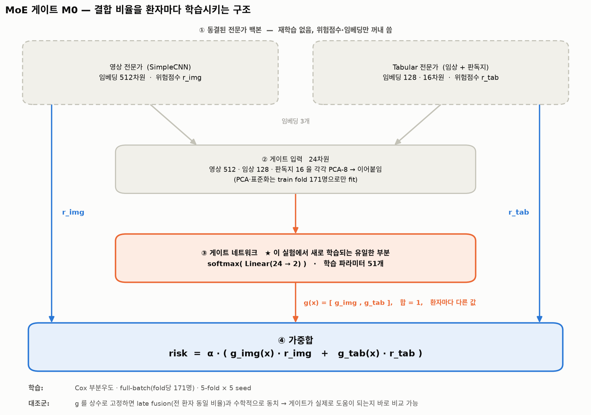
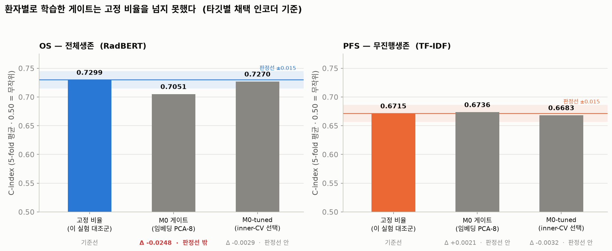

# 최종 성능 표 (보고용)

**모든 수치는 `brain_meta` 누수 수정 후(2026-08-03) 조건이며, 서로 비교 가능합니다.**
238명 · 5-fold CV(seed 42) · Cox 부분우도 · Harrell C-index · 60 epoch · batch 32

> ⚠️ 이전에 보고된 **0.7076 / 0.6678 / 0.7221** 은 수정 **전**(7/28) 값입니다.
> 데이터 조건이 달라 아래 숫자와 직접 비교하면 안 됩니다.

---

## 표 1. 최종 채택 모델 ★ (2026-09-30 확정, 기준: [README.md](README.md))

**late fusion 2-way = [임상 + 판독지 RadBERT] concat + 영상 SimpleCNN, OS·PFS 같은 모델.**

| 타깃 | C-index |
|---|---|
| **OS** | **0.7224 ± 0.0332** |
| **PFS** | **0.6470 ± 0.0286** |

> 이전 권장안은 "OS = 위 모델, PFS = 영상 뺀 임상+판독지 **TF-IDF** concat 0.6696" 이었다.
> 논문에서 판독지 인코더를 RadBERT 하나로, 두 타깃을 같은 구조로 통일하면서 바뀌었다.
> 아래 표에서 TF-IDF 값은 비교용이다.

---

## 표 2. 단일 모달리티 성능

| 모달리티 | 인코더/백본 | OS | PFS |
|---|---|---|---|
| 임상 (21변수) | MLP | 0.6388 | 0.6223 |
| 판독지 | TF-IDF (char n-gram 400) | 0.6268 | 0.6094 |
| 판독지 | **RadBERT** (frozen 768) | **0.6685** | **0.6354** |
| 판독지 | mBERT | 0.6401 | 0.5672 |
| 판독지 | KM-BERT | 0.6069 | 0.6145 |
| 영상 | SimpleCNN | 0.6570 | 0.6154 |

**판독지 단독에서는 RadBERT가 유의하게 1위** (TF-IDF 대비 10 fold 통합 Δ=+0.034,
p=0.027, 95% CI [+0.005, +0.063], 7/10 fold 개선).

---

## 표 3. 융합 방식 × 판독지 인코더 (TF-IDF → RadBERT)

**화살표 앞 = TF-IDF, 뒤 = RadBERT**

| 융합 방식 | OS | PFS |
|---|---|---|
| **판독지 단독** | 0.6268 → **0.6685** | 0.6094 → **0.6354** |
| **late (임상+판독지)** | 0.6657 → **0.6976** | 0.6280 → **0.6552** |
| **concat (임상+판독지)** | 0.7057 → **0.7153** | **0.6696** → 0.6456 |
| **late (concat+영상)** | 0.7143 → **0.7224** | **0.6621** → 0.6470 |

*(굵은 값 = 두 인코더 중 높은 쪽)*

**차이 (RadBERT − TF-IDF)**

| 융합 방식 | OS Δ | PFS Δ | 평균 |
|---|---|---|---|
| 판독지 단독 | **+0.042** | **+0.026** | **+0.034** |
| late (임상+판독지) | **+0.032** | **+0.027** | **+0.030** |
| concat (임상+판독지) | +0.010 | −0.024 | −0.007 |
| late (concat+영상) | +0.008 | −0.015 | −0.004 |

- **OS**: RadBERT가 4가지 방식 **전부에서 앞섬**. 다만 임상·영상을 더할수록
  +0.042 → +0.008로 줄어 판정 한계 아래로 내려감
- **PFS**: 임상과 **함께 학습**하면 부호가 뒤집힘(+0.027 → −0.024).
  **따로 학습**하는 late fusion에서는 +0.027 유지

---

## 표 3-1. 세 가지 융합 구조 비교 (RadBERT·`brain_meta` 수정 후로 조건 통일)

논문 Figure 1의 (a)(b)(c) 세 구조. 이전에는 (a)(b)가 TF-IDF·수정 전 조건으로
측정돼 있어 (c)(RadBERT·수정 후)와 직접 비교가 안 됐다. 세 구조를 **같은
조건(RadBERT, brain_meta 수정 후, seed 42)**으로 다시 쟀다.

| | 구조 | OS | PFS |
|---|---|---|---|
| (a) | Early fusion (concat, 3모달 end-to-end) | 0.6879 ± 0.0544 | 0.6555 ± 0.0476 |
| (b) | Late fusion, three-way (임상·판독지·영상 각각 독립) | 0.7045 ± 0.0390 | 0.6545 ± 0.0285 |
| (c) | **Late fusion, two-way (채택)** | **0.7224 ± 0.0332** | 0.6470 ± 0.0286 |

**OS는 예상대로 (c) > (b) > (a).** 다만 (b)와 (c)의 격차가 0.018로,
이전(조건 불일치 상태, −0.033)보다 좁게 나온다 — 격차의 상당 부분이 아키텍처
차이가 아니라 인코더 차이(TF-IDF→RadBERT)였다는 뜻이다.

**PFS는 순서가 다르다 — (a) ≈ (b) > (c).** RadBERT로 통일하면 채택 구조(c)가
오히려 세 구조 중 가장 낮다. 이는 새로운 모순이 아니라 표3에서 이미 확인된
현상과 같다 — RadBERT는 다른 모달리티와 **결합**될 때 PFS 신호를 깎는다
(concat Δ−0.024, late+영상 Δ−0.015). 세 구조의 PFS 차이(0.6470~0.6555)는 fold 편차
(0.029~0.048) 안이라, **PFS 에서는 구조가 성능을 가르지 않는다.** 채택 모델은 OS 기준으로
(c)를 골랐고 PFS 에도 같은 구조를 쓴다(표1). 과거에는 이 표를 근거로 PFS 만 TF-IDF 2-way(0.6621)를
쓰는 안이 있었다.

재현: `python experiments/실험12_융합방식_조건통일/exp_fusion_methods.py --targets os,pfs`
(GPU, 약 25분). 원본: `outputs/fusion_methods/results.json`

---

## 표 3-2. 2-way 에서 **어느 둘을 묶는가** (같은 조건: RadBERT · `brain_meta` 수정 후)

표3-1 의 (c) 2-way 는 세 모달리티를 **다 쓰되** 그중 둘만 한 모델로 묶어 학습하고
나머지 하나를 따로 학습해 CoxPH 로 결합한다. 묶는 조합은 셋뿐이고, 채택한 건 그중
하나다. **"왜 하필 임상과 판독지를 묶었나"에 답하는 표다.**

| | 묶음 축 | 남은 축 | OS | PFS |
|---|---|---|---|---|
| **G1** | concat[임상+판독지] | 영상 | **0.7224 ± 0.0332** | **0.6470 ± 0.0286** |
| G2 | concat[임상+영상] | 판독지 | 0.6894 ± 0.0337 | 0.6445 ± 0.0414 |
| G3 | concat[판독지+영상] | 임상 | 0.6733 ± 0.0469 | 0.6407 ± 0.0383 |

세 셀은 **모달리티 집합도 융합 구조도 같다** — 바뀌는 건 묶음뿐이라 차이를 묶음
선택에 귀속시킬 수 있다. G1 기준 fold 대응 검정:

| 묶음 | 타깃 | Δ | G1 보다 나은 fold | paired t p | wilcoxon p |
|---|---|---|---|---|---|
| G2 | OS | −0.0330 | 0/5 | **0.0099** | 0.0625 |
| G3 | OS | −0.0491 | 1/5 | **0.0459** | 0.1250 |
| G2 | PFS | −0.0025 | 2/5 | 0.8752 | 1.0000 |
| G3 | PFS | −0.0063 | 3/5 | 0.7877 | 1.0000 |

(n=5 fold 라 wilcoxon 양측 p 는 최소 0.0625 — 0.05 를 원리적으로 못 넘는다. 참고용.)

**OS 에서 묶음 선택은 실제로 성능을 가른다.** G1 은 G2 보다 5 fold **전부**에서
우세하다(p=0.010). 표3-1 의 양 끝(셋 다 묶음 / 아무것도 안 묶음)까지 한 줄로 세우면:

| 묶음 축의 구성 | OS | 영상이 |
|---|---|---|
| **G1  [임상+판독지] + 영상** | **0.7224** | 따로 |
| (b) 아무것도 안 묶음 (3-way) | 0.7045 | 따로 |
| G2  [임상+영상] + 판독지 | 0.6894 | 묶임 |
| (a) 셋 다 묶음 (early concat) | 0.6879 | 묶임 |
| G3  [판독지+영상] + 임상 | 0.6733 | 묶임 |

**영상을 어떤 모달리티와 함께 학습시키든 아무것도 안 묶은 (b) 보다 떨어지고,
영상을 떼어낸 G1 만 (b) 를 넘는다.** 즉 "묶기"가 이득인 조합은 임상+판독지 하나뿐이다.
이는 `RESULTS.md` §9.4 에서 이미 정량화된 기전(concat 에서 영상이 최종 위험점수의
발언권을 70~80% 독점해 tabular 신호를 덮는다)의 직접적인 귀결이며, 실험13은 그 기전을
묶음 조합이라는 독립적인 축에서 재확인한다.

**PFS 에서는 세 묶음이 구분되지 않는다**(Δ −0.003/−0.006, p 0.79~0.88). `RESULTS.md`
§10 의 "영상에는 PFS 정보가 없다"와 일치한다 — 영상을 어디에 두든 PFS 는 달라질 이유가
없다. 묶음 선택의 근거는 OS 에서 나오고, PFS 에서는 최소한 손해가 아니다.

재현: `python experiments/실험13_융합묶음_조합비교/exp_grouping.py --target os` 그리고
`--target pfs` (GPU, 타깃당 약 25분). 원본: `outputs/fusion_grouping/results_{os,pfs}.json`.
상세 기록은 `experiments/실험13_융합묶음_조합비교/README.md`.

---

## 표 4. concat 구조 변형 (RadBERT, OS)

| 변형 | 융합 지점 (판독지:임상) | OS | 현행 대비 |
|---|---|---|---|
| **현행** | 16:128 | **0.7153** | — |
| balanced_32 | 32:32 | 0.7121 | −0.003 |
| clin32 | 16:32 | 0.7111 | −0.004 |
| clin16 | 16:16 | 0.7041 | −0.011 |
| rep32 | 32:128 | 0.6874 | −0.028 |
| rep64 | 64:128 | 0.6870 | −0.028 |

**현행 구조가 최적** — 어느 방향으로 바꿔도 개선되지 않음.

---

## 표 5. `brain_meta` 수정 전후 비교

| 모델 | 수정 전(TF-IDF, 7/28) | 수정 후(RadBERT) | 차이 |
|---|---|---|---|
| 임상+판독지 OS | 0.7076 | 0.7153 | +0.0077 |
| 임상+판독지 PFS | 0.6678 | 0.6456 | −0.0222 |
| late fusion + SimpleCNN OS | 0.7221 | 0.7224 | +0.0003 |
| late fusion + ResNet18 OS | 0.7131 | 미측정 (RadBERT×ResNet18 조합 실험 안 함) | — |

> ⚠️ 이 표는 brain_meta 수정 효과만이 아니라 **판독지 인코더 교체도 진행함
> (TF-IDF→RadBERT) 효과까지 같이 섞여 있습니다.** 두 효과를 분리해서 보려면
> 표3(같은 인코더끼리 수정 후 비교)을 참고

**OS는 두 변화(누수 수정 + RadBERT 교체)를 합쳐도 성능이 거의 그대로 유지되거나
소폭 개선**됐습니다. PFS는 RadBERT로 바꾸면서 하락(−0.022)했는데, 이건 이미 알려진
"RadBERT가 PFS엔 안 맞는다"는 결과와 일치합니다(당시에는 그래서 PFS만 TF-IDF를 유지했으나, 최종 채택은 두 타깃 모두 RadBERT — 표1).

- HR = 1 → 뇌전이 있으나 없으나 위험도 똑같음
- HR = 1.21에서 1.82 로 오름→ 뇌전이 있는 환자가 없는 환자보다 위험도(사망/재발 속도)가 1.82배, 즉 82% 더 높음
- 수정 전 "brain_meta=1" 그룹 (84명) =
   진짜 나쁜 예후 48명(초기부터 전이)  +  오래 살아서 늦게 발견된 34명(사실 예후 좋음)
   
   → 이 84명을 한 덩어리로 "위험도 계산" 하면
   → 나쁜 신호(48명)와 좋은 신호(34명)가 서로 상쇄돼서
   → 평균 HR이 약하게(1.21) 나옴

- 수정 후 "brain_meta=1" 그룹 (48명만) =
   진짜 나쁜 예후 48명만 남김
   
   → 좋은 신호를 내던 34명을 빼버리니
   → 나쁜 예후 신호가 희석 없이 그대로 드러남
   → HR이 진짜 값(1.82)으로 나옴

한편 **변수 자체의 예후 예측력은 크게 개선**되었습니다:

| | 수정 전 | 수정 후 |
|---|---|---|
| `brain_meta` 단변량 HR (OS) | 1.21 (p=0.203, **무의미**) | **1.82 (p=0.0005)** |
| `brain_meta` 단변량 HR (PFS) | 1.31 (p=0.055) | **1.85 (p=0.0002)** |

**수정 내용**: 뇌전이 84명 중 34명(40.5%)이 **진단 후에 생긴 이시성 전이**였습니다.
이는 진단 시점에 관측 불가능한 미래 정보이므로 기저 예측변수로 쓸 수 없습니다
(불멸시간 편향 — 실제로 이시성 전이군의 OS 중앙값이 564일로, 전이 없는 군 352일보다
길었습니다). **기저 시점 전이만 남겨 48명으로 정정**했습니다.

---

## 표 6. MoE 게이트 융합 실험 (late fusion의 고정 결합비율을 학습형으로 대체 시도)

**동기.** late fusion은 영상·tabular 두 위험점수를 **전 환자에게 똑같은 비율**로 섞는다.
그런데 환자마다 영상이 유용한 정도는 다를 수 있다 — 실험9에서 병기(LS/ES)에 따라
영상 가중치가 다른 방향으로 관측됐다(LS n=72로 미확정). RESULTS.md §9.7.4도 다음
우선순위로 **입력의존 게이트**를 지목했는데, 게이트값은 환자마다 변하므로 무효였던 고정
스케일과 달리 선형 head와 수학적으로 중복이 아니다. 그래서 "결합 비율을 환자마다
학습시키면 더 나아지는가"를 검증했다.

**방법.** 두 백본은 **동결**하고 그 위에 결합 비율만 내는 게이트를 새로 학습시켰다
(학습 파라미터 51개). 게이트 입력은 전문가 임베딩 3개를 각각 PCA-8로 줄여 이어붙인
24차원이고, softmax 출력이 환자별 비율 g(x)가 된다. 게이트를 상수로 고정하면 late
fusion과 수학적으로 동치이므로, 같은 코드로 기준선을 재현해 공정하게 비교했다.
tabular 축 판독지 인코더는 이 실험 당시의 타깃별 선택을 따랐다 — **OS는 RadBERT,
PFS는 TF-IDF**(concat 조합에서 PFS는 RadBERT가 오히려 나쁘다: 0.6696 → 0.6456).
최종 채택 모델은 두 타깃 모두 RadBERT 다(표1).

**결론과 분석 — 3가지.**

1. **게이트는 "배우긴 했지만 일반화되지 않았다".** g(x)는 실제로 환자마다 다른 값을
   냈다(영상 가중치의 fold별 표준편차 0.26~0.35 — 상수로 붕괴하지 않았다는 뜻). 그런데
   처음 보는 환자(held-out)에서는 고정 비율을 넘지 못했다. 즉 게이트가 찾아낸 "환자별
   차이"는 진짜 신호가 아니라 **fold당 171명 규모에서 생긴 노이즈**였다.

2. **하이퍼파라미터를 안전하게 골라도 결과가 같았고, 그 이유까지 확인했다.** 후보 9개를
   train 안쪽 inner-CV로 고른 M0-tuned도 Δ −0.0029(OS)/−0.0032(PFS)로 판정선 안이었다.
   결정적으로, inner-CV 분할 시드를 42~45로 바꿔 "1등 후보"가 재현되는지 봤더니
   **10개 fold 중 4개 시드가 모두 같은 후보를 고른 경우가 0개**였다. 후보 사이에 실력차가
   애초에 없어서 1등이 운으로 정해졌다는 뜻 — 게이트가 배울 신호가 없다는 직접 증거다.

3. **따라서 한계는 "결합 방식"이 아니라 "표본 크기"다.** 결합을 더 유연하게 만드는 방향은
   이 데이터에서 소진된 것으로 보고, **결합 비율은 고정 방식을 유지한다**(표 1). 대신 다음
   개선은 학습 파라미터를 늘리지 않는 쪽으로 옮겼다(표 7의 시드 앙상블).

⚠️ **기준선 읽는 법 (1) — 비교 대상 자체가 다르다.** 이 실험 당시 PFS의 공식 수치
(0.6696)는 **영상을 아예 뺀** TF-IDF tabular 단독 모델이라, 영상+tabular를 섞는 이 게이트
실험과는 비교 대상이 아니었다. 영상을 포함한 당시 late fusion은 표 3의 "late(concat+영상)"
행 **OS 0.7224(RadBERT) / PFS 0.6621(TF-IDF)**이다 — 이게 그림의 기준선과 견줄 수치다.
(현재 최종 채택 모델의 PFS 는 RadBERT 판 0.6470 이다 — 표 1.)

⚠️ **기준선 읽는 법 (2) — 그래도 그 수치와 정확히 같지 않다.** 그림의 기준선(OS 0.7299 /
PFS 0.6715)은 위 공식 late fusion(OS 0.7224 / PFS 0.6621)과도 **다른 방식으로 계산된
값**이다 — 결합 비율(계수)을 학습할 때 tabular 축의 "train" 점수로 무엇을 쓰는지가
다르다. 공식 파이프라인(`src/sclc/late_fusion.py::combine_risk_scores`)은 train 환자에도
항상 **다른 fold 모델이 매긴 진짜 OOF 점수**를 쓰는 반면, 이 실험의 재현 코드
(`coxph_reproduction`)는 **그 fold 모델이 자기 학습 데이터를 스스로 채점한 값**
(in-sample)을 쓴다 — 코드에 내장된 진단(`g4_in_sample_vs_oof`)으로 실측하면 이
in-sample 점수는 fold에 따라 진짜 OOF보다 C-index가 최대 +0.10까지 부풀려져 있다.
그 부풀려진 train 점수로 결합 계수를 학습하니 계수 자체가 달라지고(tabular 계수 평균
7.06 vs 공식 4.44), test 적용 결과도 갈린다.

**다만 게이트와 이 대조군은 똑같이 그 in-sample 이점을 받으므로, "게이트가 대조군을
못 넘었다"는 이 실험 내부 비교(FAIL 판정)는 그대로 유효하다** — 무효화되는 것은 오직
"이 기준선 = 공식 late fusion"이라는 등식뿐이다. OS를 TF-IDF로 재실행해도(PFS는 이미
TF-IDF) 이 실험 내부의 FAIL 결론은 동일하다. 상세 아키텍처·fold별 수치와 여기 싣지
않은 변형(M1 attention, prior 게이트)은
[experiments/실험11_MoE/RESULTS_ALL.md](experiments/실험11_MoE/RESULTS_ALL.md) 참고 — 단, 그 문서 §5가 이
차이를 "재구성 오차"로 서술한 것은 부정확하다(오차가 아니라 in-sample/OOF 방법론
차이).

---

## 표 7. 멀티시드 딥앙상블 (RadBERT)

**동기.** 이 문서의 모든 채택 수치는 **seed 42 단일 실행**이다. 그런데 실험1의 6시드
sweep에서 tabular 축의 학습 시드 잡음이 **sd 0.0114(OS)/0.0147(PFS)** 로, 이 문서가
판정선으로 쓰는 0.015에 육박한다 — 즉 지금까지 비교해 온 효과들과 **시드 운이 같은
규모**다. 한편 표 6에서 "결합을 더 유연하게" 방향은 표본 부족으로 소진됐는데, 시드
평균은 **학습 파라미터를 하나도 추가하지 않으므로** 그 표본 크기 논리에 걸리지 않는다.
그래서 재학습 없이(이미 캐시된 6시드 OOF 위험점수만 사용) 시드 앙상블의 실익을 쟀다.

**방법.** 6시드(42/142/242/342/442/542)의 OOF 위험점수를 (시드, fold) 안에서 정규화 후
환자별 평균 → 기존 fold별 2변수 CoxPH 결합에 투입. 시드는 성능을 보고 고르지 않고
**6개 전부** 사용(고르면 test 선택편향). C-index는 관례대로 fold별 계산 후 평균.

| 구성 | OS tabular | OS late(+영상) | PFS tabular | PFS late(+영상) |
|---|---:|---:|---:|---:|
| seed 42 (표1·표3 채택 수치) | 0.7153 | 0.7224 | 0.6456 | 0.6470 |
| 개별 6시드 평균 ± sd | 0.7018 ± 0.0114 | 0.7103 ± 0.0085 | 0.6503 ± 0.0147 | 0.6531 ± 0.0123 |
| **6시드 앙상블** | **0.7277** | 0.7256 | **0.6744** | 0.6732 |
| 앙상블 − 개별평균 | **+0.0260** | +0.0153 | **+0.0241** | +0.0202 |
| 앙상블 − seed 42 | +0.0125 | +0.0032 | +0.0288 | +0.0262 |

*(앙상블 행은 raw 평균 기준. z-정규화/순위평균으로 바꿔도 ±0.005 안에서 동일한 그림)*

**분석**

- **앙상블 이득은 fold 쌍대 검정으로 뒷받침된다.** "임의의 한 시드에서 기대되는 성적"
  (fold별 6시드 평균) 대비 tabular 앙상블이 **5/5 fold 개선, paired t p=0.004~0.026**
  (RadBERT; TF-IDF도 4~5/5 fold, p=0.005~0.033으로 동일). 이 문서에서 다룬 어떤 융합
  기법보다 큰 효과이며, 파라미터를 늘리지 않고 얻은 것이라 표 6의 실패 원인(표본 부족)과
  무관하다. *(단 fold n=5라 검정력은 낮다 — 참고용)*
- **채택 수치는 시드 운을 타고 있었다.** OS의 seed 42는 6시드 중 1위(우호적 뽑기)인
  반면, PFS의 seed 42는 평균 이하(0.6456 < 0.6503)라 오히려 레시피 실력을 **과소평가**
  한다. 어느 쪽이든 test 성능을 보고 시드를 고를 수는 없으므로, 앙상블은 그 선택 없이
  분포 상위에 안정적으로 도달하는 원칙적 대안이다.
- **RadBERT에서는 앙상블이 융합 이득을 흡수한다.** 융합 이득(late − tabular)이
  OS +0.0086 → **−0.0021~+0.0044**, PFS +0.0027 → **−0.0018~+0.0010** 으로 소멸하고,
  앙상블한 **tabular 단독(0.7277)이 영상을 얹은 late fusion(0.7256)보다 높다.**
  해석: late fusion이 사주던 것의 상당 부분이 상보적 영상 정보가 아니라 **분산 감소**
  였을 수 있다 — 영상 축은 시드 sd가 **OS 0.0024 / PFS 0.0082** 로 tabular(0.0114/
  0.0147)보다 훨씬 작아 거의 결정적이라, 잡음 큰 tabular와 섞이면 그 잡음이 희석된다.
  시드 평균은 그 효과를 더 직접적으로 달성하므로 남는 몫이 없다. 표 3의 "임상·영상을 더할수록 RadBERT 이점이 +0.042→+0.008로 줄어든다"와 같은
  방향의 현상이다.
- **단, 이 흡수 현상은 RadBERT 한정이다.** TF-IDF 축에서는 앙상블 이득은 같게 나오지만
  (+0.019~+0.021) 융합 이득은 OS에서 줄기만 하고(+0.0094 → +0.0030~+0.0087) PFS는
  그대로 유지된다(+0.0051 → +0.0043~+0.0053). 더 강한 tabular(RadBERT) 위에서 영상이
  더 빨리 잉여가 된다는 뜻으로 읽힌다.
- **미확정.** 앙상블 후 융합 이득의 fold 쌍대 검정은 RadBERT에서 **전부 귀무**
  (p=0.48~0.86, 2~3/5 fold) — 다만 이건 "영상이 무용하다"의 증명이 아니라 fold n=5의
  낮은 검정력에서 나온 무증거다. 정규화 변형 3종에서 부호까지 갈리므로, 확정하려면
  실험9/11 방법론(환자단위 Poisson 부트스트랩 B=2000)으로 다시 재야 한다. 현재까지의
  §10 결론(영상은 OS 신호를 실제로 담고 있음)과 모순되지는 않는다 — 그 신호가 잡음을
  제거한 tabular가 이미 아는 것과 **중복**이라는 쪽에 가깝다.

재현: `python experiments/실험1_기본융합_early_late/analyze_late_fusion.py seed-ensemble --report_encoder {radbert,tfidf}`
(재학습 없음, 수 초). 원본 데이터 `outputs/late_fusion_seed_sweep{,_radbert}/` →
산출물 `outputs/seed_ensemble/results_{tfidf,radbert}.json`

---

## 판정 기준에 대한 참고

이 실험에서 두 모델을 비교할 때, fold별 차이의 **표준오차는 0.008~0.014**입니다.
예를 들어 RadBERT vs TF-IDF의 OS 비교에서 fold별 차이가
`[−0.021, −0.023, +0.013, +0.055, +0.010]` 으로 널뛰며, 표준오차가 0.0142입니다.

즉 **차이가 0.015 내외보다 작으면 우연과 구분하기 어렵습니다.** 위 표에서 |Δ|가 그보다
작은 항목은 "차이가 있다"고 주장하지 않는 것이 안전합니다.

---

**원본 데이터**: `outputs/radbert_fusion/` · `outputs/radbert_full/` ·
`outputs/radbert_concat/` · `outputs/reportonly_*/` · `outputs/brainfix/`
**상세 분석**: [REPORT_ENCODER_FINAL.md](experiments/실험6_판독지_인코더_비교/REPORT_ENCODER_FINAL.md)
